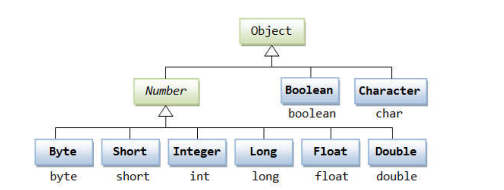

# Comportamentos de memória, arrays e listas

## Tipos referência vs. tipos valor

Classe | Tipo primitivo
---- | ----
Vantagem: usufrui de todos os recursos da OO | Vantagem: é simples e mais performático
Variáveis são ponteiros | Variáveis são caixas
Objetos precisam ser instanciados usando new, ou apontar para um objeto já existente | Não instancia. Uma vez declarados, estão prontos pra uso
Aceita valor null | Não aceita valor null
Y = X = "Y passa a apontar para onde X aponta" | Y = X = "Y recebe uma cópia de X"
Objetos instanciados no heap | "Objetos" são instanciados no HEAP
Objetos não utilizados são desalocados em um momento próximo pelo garbage collector | "Objetos" são desalocados imediatamente quando seu escopo de execução é finalizado 

<br/>
<br/>

## Garbage collector
- É um processo que automatiza o gerenciamento de memória de um programa em execução
- O garbage collector monitora os objetos alocados dinamicamente pelo programa (no heap), desalocando aqueles que não estão mais sendo utilizados.

<br/>
<br/>

## Vetores

- Vetor é o nome dado a arranjos unidimensionais
- Arranjo (array) é uma estrutura de dados: 
  - Homogênea (dados do mesmo tipo)
  - Ordenada (elementos acessados por meio de posições)
  - Alocada de uma vez só, em um bloco contíguo de memória

- Vantagens: 
  - Acesso imediato aos elementos pela sua posição
- Desvantagens:
  - Tamanho fixo
  - Dificuldade para se realizar inserções e deleções

<br/>
<br/>

## Boxing, Unboxing, e Wrapper classes

- Boxing:
  -  É o processo de conversão de um objeto tipo valor para um objeto tipo referência compatível
- Unboxing:
  - É o processo de conversão de um objeto tipo referência para um objeto tipo valor compatível
- Wrapper classes
  - São classes equivalentes aos tipos primitivos
  - Boxing e unboxing é natural na linguagem
  - Uso comum: campos de entidades em sistemas de informação (IMPORTANTE!) - Pois tipos referência (classes) aceitam valor null e usufruem dos recursos OO




<br/>
<br/>

## Laço For Each

Sintaxe:
```java
for (Tipo apelido : coleção) {
  <comando 1>
  <comando 2>
}
```


<br/>
<br/>

## Listas

- Lista é uma estrutura de dados:
  - Homogênea (dados do mesmo tipo)
  - Ordenada (elementos acessados por meio de posições)
  - Inicia vazia, e seus elementos são alocados sob demanda
  - Cada elemento ocupa um "nó" (ou nodo) da lista

- Tipo (interface): List
- Classes que implementam: ArrayList, LinkedList, etc.

- Vantagens: 
  - Tamanho variável
  - Facilidade para se realizar inserções e deleções
- Desvantagens:
  - Acesso sequencial aos elementos *

<br/>

```java
// - Tamanho da lista: 
    size()
// - Obter o elemento de uma posição: 
    get(position)
// - Inserir elemento na lista: 
    add(obj), add(int, obj)
// - Remover elementos da lista: 
    remove(obj), remove(int), removeIf(Predicate)
// - Encontrar posição de elemento: 
    indexOf(obj), lastIndexOf(obj)
// - Filtrar lista com base em predicado:
  List<Integer> result = list.stream().filter(x -> x > 4).collect(Collectors.toList());
// Encontrar primeira ocorrência com base em predicado:
  Integer result = list.stream().filter(x -> x > 4).findFirst().orElse(null);
```

<br/>
<br/>

## Matrizes

- Em programação, "matriz" é o nome dado a arranjos bidimensionais
  - Atenção: "vetor de vetores"