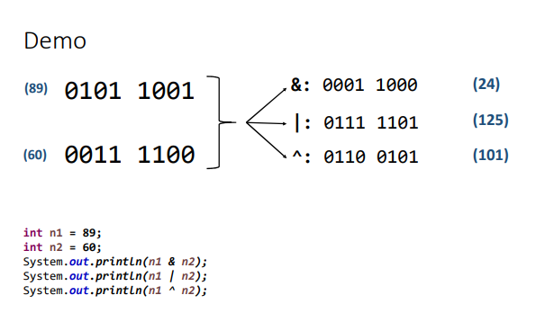

# Outros tópicos básicos sobre Java

## Restrições e convenções para nomes

- não pode começar com dígito: use letra ou _
- não usar acentos ou til
- não pode ter espaço em branco

~~~java
int _5minutos;
int salario;
int salarioDoFuncionario;
~~~

### Convenções

- CamelCase para pacotes, atributos, métodos, variáveis e parâmetros;
- PascalCase para classes - Ex: "ProductService"

## Operadores bitwise

Operadores que realizam operações lógicas bit a bit em valores. Geralmente utilizado em programação de baixo nível.

Operador | Significado
--- | ---
& | Operador "E" bit a bit
\| | Operador "OU" bit a bit
^ | Operação "OU-exclusivo" ou "XOR" bit a bit (quando apenas uma das condições é verdadeira)

## Funções interessantes para String

- formatar: toLowerCase(), toUpperCase(), trim()
- recortar: substring(inicio), substring(inicio, fim)
- substituir: replace(char, char), replace(string, string)
- buscar: indexOf(), lastIndexOf()
- dividir com base em um separador: split(")

## Comentários em Java

~~~java
/*
Comentário
    de 
        Bloco
*/

// Comentário de linha
int idade; // Comentário de linha
~~~

Constitui-se uma boa prática evitar o uso exagerado de comentários.

## Funções (sintaxe)

- representam um processamento que possui significado
- vantagens:: modularização, delegação e reaproveitamento
- dados de entrada e saída: podem receber dados de entrada e podem ou não retornar uma saída
- em OOP, funções de classe recebem o nome de "métodos"
